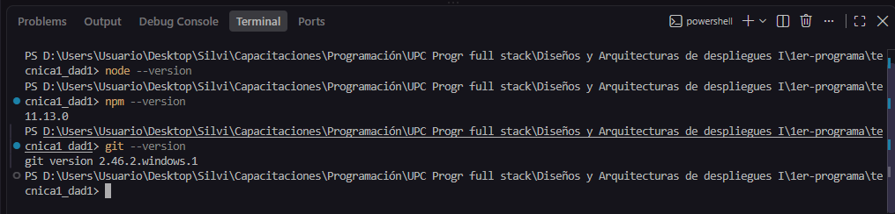
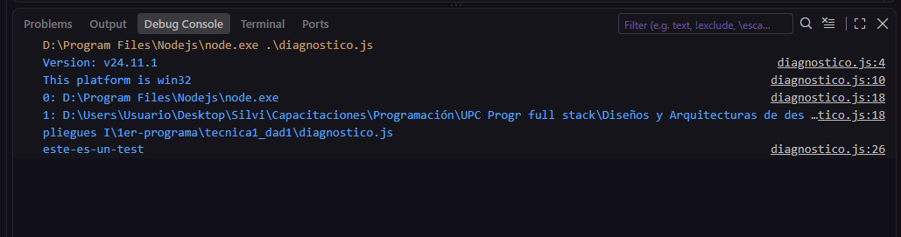
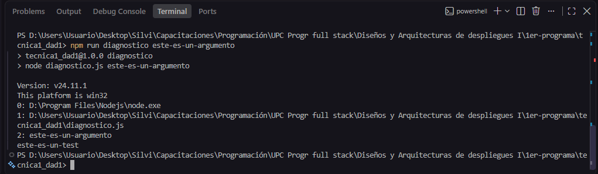

# TP 01 - Inicio y entorno

> Materia: Diseños y Arquitecturas de despliegues 1

> Profesor: Christian Di Guardia

> Alumna: Palaoro Silvina


## Consigna de la Tarea 2 

Instalar o verificar Node.js LTS, npm, Git y VS Code. Crear un repositorio y programar diagnostico.js para informar versiones, plataforma, argumentos y una variable de entorno. Agregar scripts npm para ejecutar el diagnóstico.


## Primera parte

Para la primera parte de la consigna, en la terminal del VSC hice los siguientes comandos (por separado):

```
node --version
npm --version
git --version
```


Como ya tenía los tres instalados obtuve sus versiones:

- v24.11.1

- 11.13.0

- git version 2.46.2.windows.1


Dejo a continuación una captura de pantalla de los comandos y lo que obtuve en la terminal




## Segunda parte

Para la segunda parte de la consigna, primero hice 

```
npm init
```

para que se creara el package.json y luego en "scripts" agregé 

```
"diagnostico": "node diagnostico.js"
```

Luego, consulté la documentación oficial de Node.js, en la sección donde se explicaban y ejemplificaban los distintos métodos de process de Node.

https://nodejs.org/docs/latest/api/process.html

En esta lista de métodos busqué todos los métodos requeridos en la consigna y los copié en el archivo diagnostico.js de este repositorio.

Luego ejecuté el archivo de varias formas. 

1. Lo ejecuté con la Consola de Depuración, haciendo F5. Dejo aquí la captura de lo obtenido





2. Lo ejecuté mediante la terminal con el comando 

```
node diagnostico.js prueba
```
Y obtuve:

```
PS D:\Users\Usuario\Desktop\Silvi\Capacitaciones\Programación\UPC Progr full stack\Diseños y Arquitecturas de despliegues I\1er-programa\tecnica1_dad1> npm run diagnostico prueba

> tecnica1_dad1@1.0.0 diagnostico
> node diagnostico.js prueba

Version: v24.11.1
This platform is win32
0: D:\Program Files\Nodejs\node.exe
1: D:\Users\Usuario\Desktop\Silvi\Capacitaciones\Programación\UPC Progr full stack\Diseños y Arquitecturas de despliegues I\1er-programa\tecnica1_dad1\diagnostico.js
2: prueba
este-es-un-test
```


3. Por último, lo corrí usando el script que había hecho en el package.json y con el argumento: "este-es-un-argumento", con el comando:


```
npm run diagnostico este-es-un-argumento
```

Dejo aquí una captura de lo que obtuve



